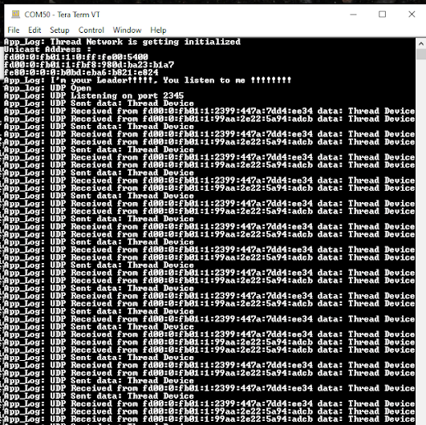
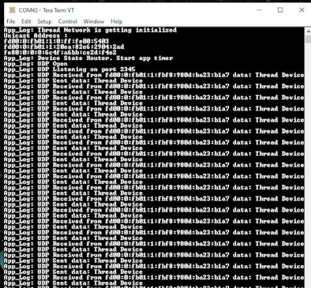
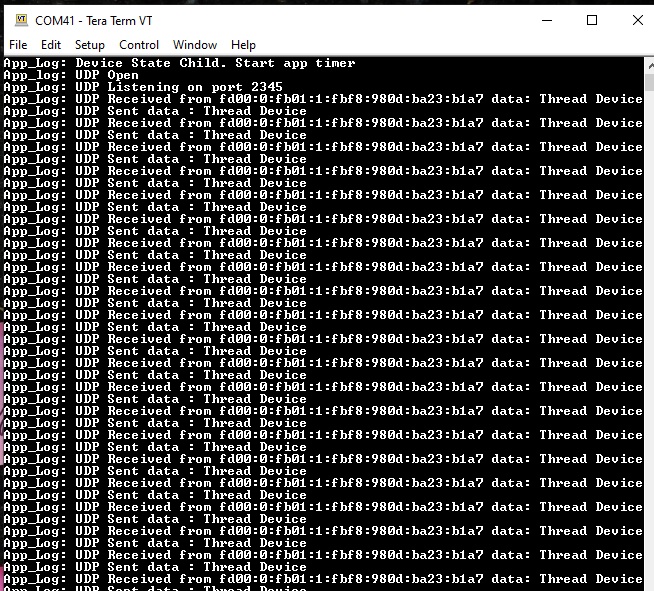
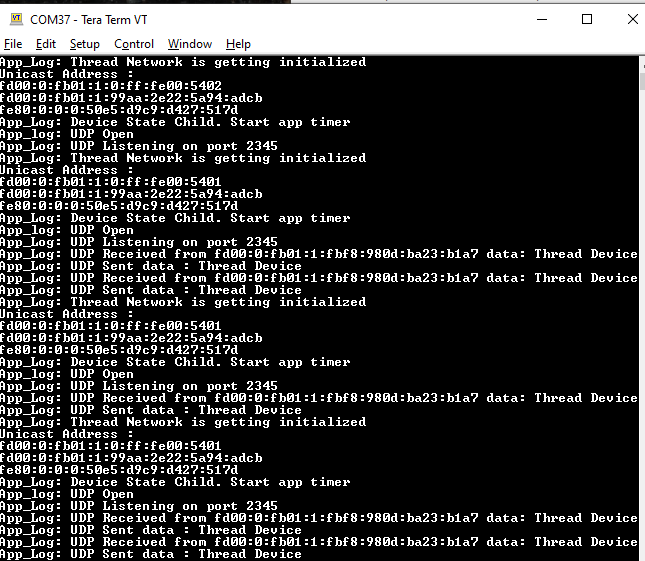

# Running the UDP Demo Application

**The output generated by the FTD Leader console.**

**The output generated by the FTD Router console.**

**The output generated by the MED console.**

**The output generated by the SED console.**

**Parent topic:**[Thread UDP Demo Application](GUID-B9324B07-E12F-4AC3-B913-1E4A7C5C0E9E.md)

