# Creating a new MCC Harmony Project

This section briefs about the project generation, MCC configuration using CLI, Thread  component and details about the default project configuration considered for thread  SDK.

 

**Note:** The below steps are common and necessary for both FTD and MTD projects.

 

1.  Create MCC Project for any one of PIC32CXBZ2 devices \(WBZ450 /WBZ451 /PIC32CX1012BZ25048 /PIC32CX1012BZ24032\)
2.  OpenMCC Window. By default, the MCC window will appear as follows.

     

    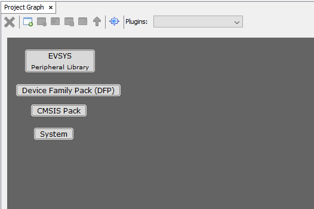

     

3.  OnceProject graph is getting displayed for the created project, Double click on the **CLI** component.

     

    **Note:** CLI and Thread Stack components will appear in Device Resources only ifwireless\_thread is cloned in MCC framework path.

     

    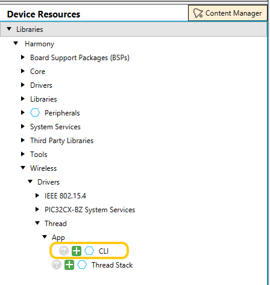

     

     

4.  Upon selecting the component, the MCC will auto activate the Thread stack as  dependent module. Thread stack and other inter dependent component dependencies  will be auto activated and shows Popup for getting the approval. Select “Yes�  for all of them.

     

    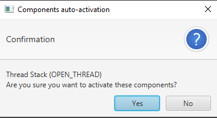

     

5.  CLI will auto activate the Thread USART capability as part of its functional usage. Then PHY component dependencies auto activation will be triggered.

     

    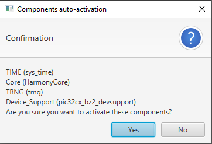

     

    Below are the list of PHY Component Dependencies.

    1.  DeviceSupport Library
    2.  Core
    3.  TRNG
    4.  SYSTEM Time Module \(PHYUses one client of SYS\_TIME\_MODULE\) – So, the number of SYS\_TIME\_CLIENT should be more than 1.
6.  IEEE802.15.4 PHY doesn't processes request through a seperate Free RTOS task and below is the IEEE 802.15.4 PHY configurtaion for Microchip Thread SDK.

     

    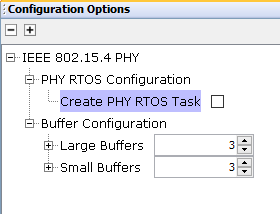

     

7.  Below is the Device support library configuration considered for the Microchip Thread SDK.

     

    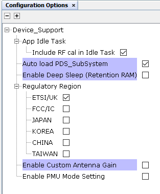

     

8.  The project graph will look like

     

    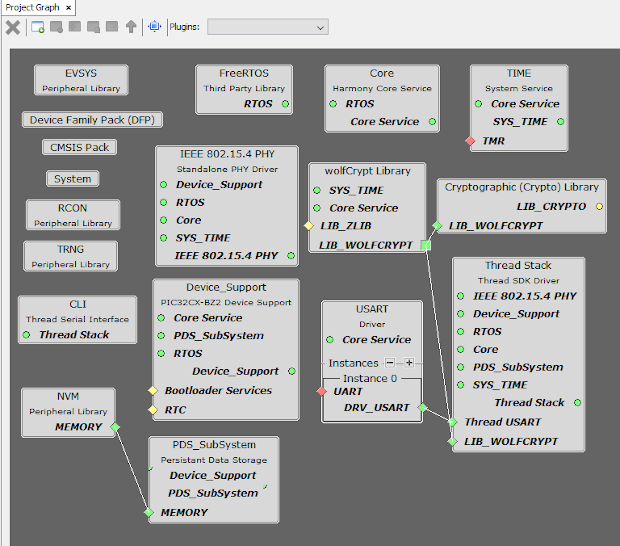

     

9.  RightClick on TIME module for selecting the timer source, Select any of the timer.

     

    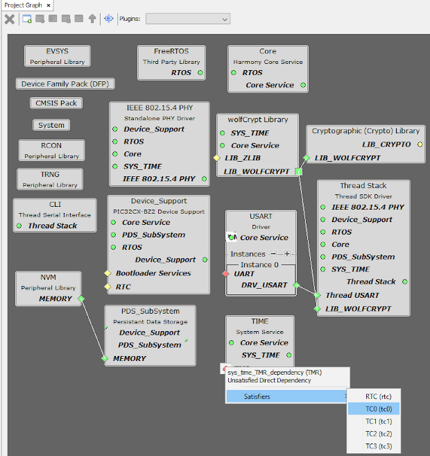

     

10. Below is the TC0 configuration considered for the Microchip Thread SDK.

     

    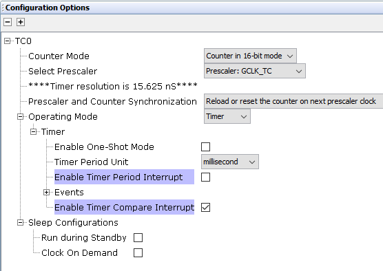

     

11. Choose the Thread role under CLI configuration options as shown below.

    Select the Device Role as FTD for CLI+Thread  FTD project.

     

    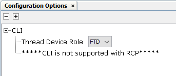

     

    Select the Device Role as MTD for CLI+Thread MTD project.

     

    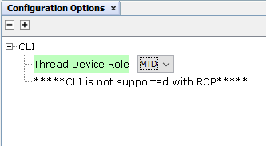

     

12. Right click onUSART Driver =\> Go to Satisfiers =\> Click on SERCOM0\(sercom0\)

     

    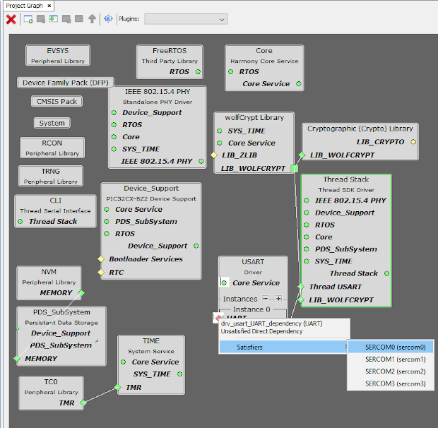

     

13. Click on SERCOM 0 =\> Go to configuration options =\> Change Receive pinout, Transmitpinout.

     

    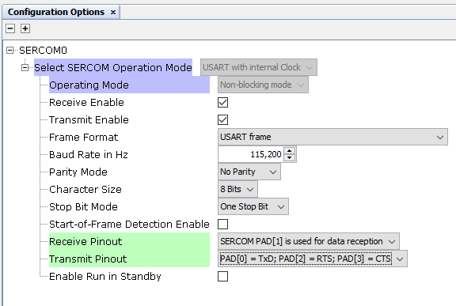

     

14. Configure the SERCOM0 system setting to enable the Direct High Speed inside system Configuration options → Generate Fues → DEVCFG1.

     

    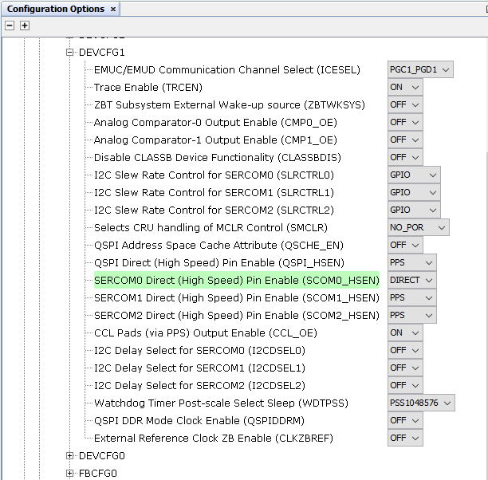

     

15. Click on Generate Tab for Code generation. Upon code generation, Thread files will be added to the project.

     

    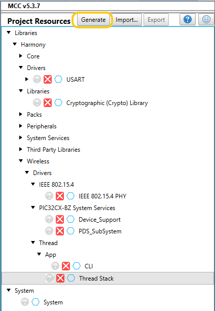

     

16. Once Generation completes the header, source files of Thread will be added under config =\> driver/thread.

     

    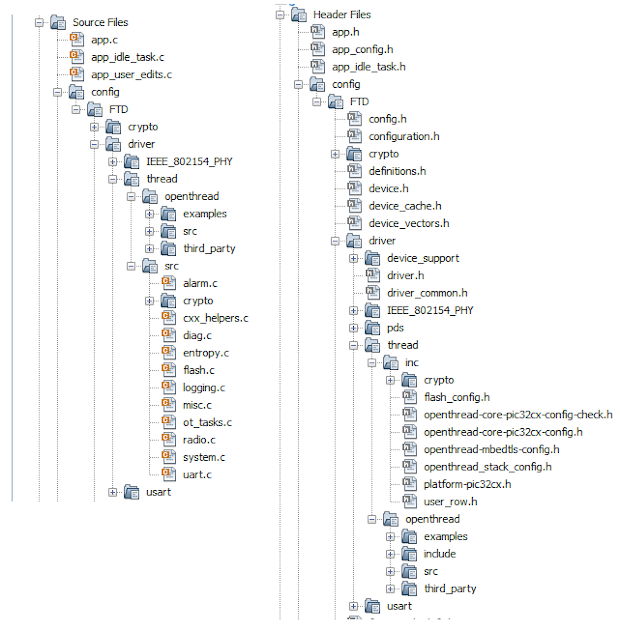

     

17. RTOS task for thread stack will be created tasks.c file and otSysInit \(\) will be called fromSYS\_Initialize\(\) function.
18. app\_user\_edits.cfile changes: selected line should be commented.

     

    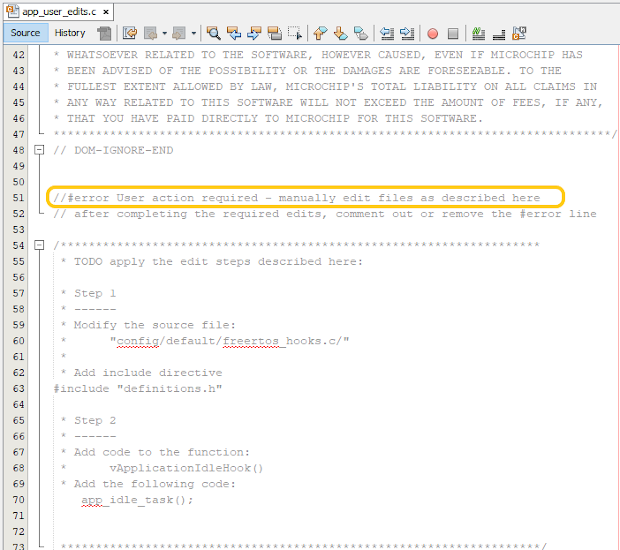

     

**Parent topic:**[Microchip Thread SDK](GUID-35F8786B-0912-4736-BD9F-7975E01A9D0E.md)

