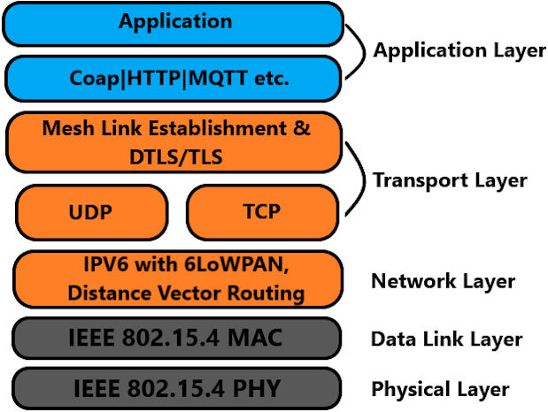

# Introduction

The Thread stack is a reliable and cost-effective open standard for low-power wireless  device-to-device \(D2D\) communication. It is specifically designed for Connected Home  applications that require IP-based networking and support a variety of application  layers on the stack.

**General Characteristics of Thread:**

The following are the typical features of the Thread stack and network:

-   **Simple network installation, start up and operation:**Simple protocol for forming, joining, and maintaining Thread Networks allow systems to self-configure and fix routing problems as they occur.
-   **Secure:** In order to ensure the security of the Thread Network, devices are only allowed to join if they have been authorized and all communications are encrypted and secure.
-   **Small and large networks:** Home networks can range from a few devices to hundreds of devices that communicate with each other seamlessly. The network layer is specifically designed to enhance the network's performance based on the intended usage.
-   **Range:**Typical devices in conjunction with mesh networking provide sufficient range to cover a normal home. Spread spectrum technology is used at the physical layer to provide good immunity to interference.
-   **No single point of failure:** The stack is designed to provide secure and reliable operations even with the failure or loss of individual devices.
-   **Low power:** Host devices can typically operate for several years on AA type batteries using suitable duty cycles.

**Architecture of Thread Stack:**

The Thread stack architecture is based on the IEEE 802.15.4 standard and is designed to  support IPv6 networking. It is composed of various layers, including the physical, MAC,  network, transport, and application layers. Each layer has a specific function that is  essential for the Thread network's operation. The physical layer is responsible for  transmitting and receiving data wirelessly. The MAC layer manages data transmission  between devices and provides access to the wireless medium. The network layer routes  data between devices in the network. The transport layer ensures reliable data delivery  and error correction. Finally, the application layer serves as the interface between the  Thread network and the device's application.

 

 

To obtain further information regarding the thread protocol, kindly refer to the [references](GUID-BC52749F-3DFC-4DBE-AAFE-23BB5FC83662.md)  section for relevant links.

**Microchip Thread SDK Overview:**

The Microchip SDK for Thread offers support through MPLAB Code Configurator\(MCC\)  component, a user-friendly GUI tool that simplifies configuration and generates code  based on the selected Thread configuration. The purpose of this software development kit  \(SDK\) is to provide support for system-on-chip \(SOC\) and radio co-processor \(RCP\)  designs. Additionally, it includes Mbed TLS handling, which is an implementation of the  TLS and SSL protocols that enables open thread operation with the necessary  cryptographic algorithms required by the open thread. This SDK also offers a thread  command line interface \(CLI\) application as a separate MPLAB Code Configurator  component, which is available for system-on-chip designs.

More details about the Microchip Thread SDK can be found in the upcoming sections.

