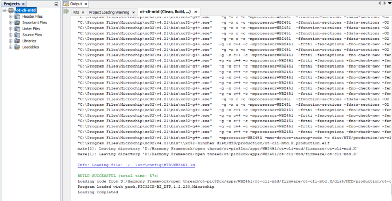
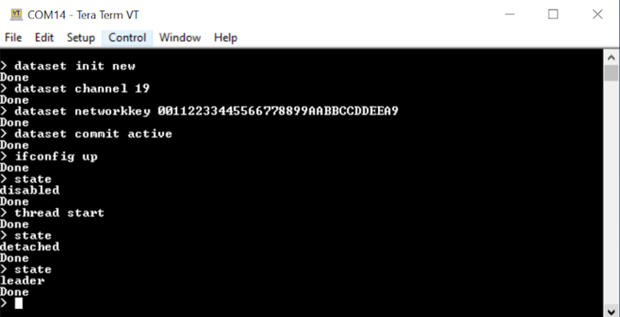
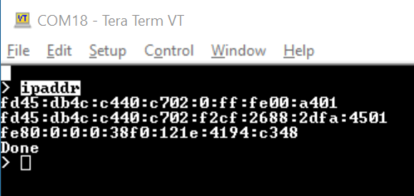
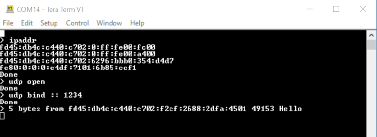
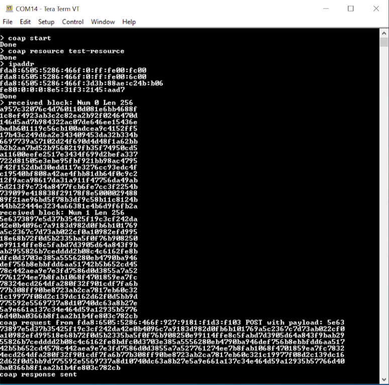
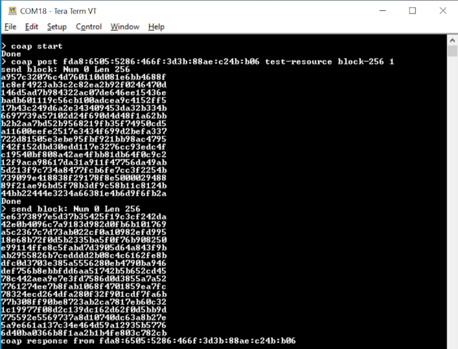

# Building and running a project

This section provides the setps for building and running projects. Please follow the instructions<br /> outlined in the "[Creating a new MCC Harmony project"](GUID-10731AEE-FEA5-4059-8279-2DBFBDBAD2F0.md) section and generate two projects. One<br /> project should have FTD as the device role, while the other should have MTD as the<br /> device role, with the CLI App included. The default settings can be used for all other<br /> configurations. Once the projects are created build the projects and build should be<br /> successful.

The following scenario outlines the formation of a thread network and the exchange of<br /> data between a leader \(FTD\) and an end device \(MTD\). Node1 serves as the leader \(FTD\),<br /> while node2 functions as the end device\(MTD\).

1.  Once the projects are created right click on the project, "Clean and Build" option and Flash the firmwares into two WBZ451 Xplained Pro boards as shown below.

    **Building the FTD project:**

    <br />

    

    <br />

    **Building the MTD project:**

    <br />

    

    <br />

    **Flashing the projects:**

    Flash the FTD and MTD firmwares into each<br /> device selecting in project properties → Connected Hardware Tool as shown<br /> below

    <br />

    

    <br />

    <br />

    

    <br />

2.  Open Tera Term Serial tool and Goto Setup → Serial port and set the following settings as shown in below.

    <br />

    

    <br />

3.  The below commands are to be inputted in node1 to form the thread network with Leader role. After successful inputting of each comand thread stack responds as "Done".

    <br />

    ``` {#CODEBLOCK_KTL_QXZ_5YB}
    **Node1:**
    > dataset init new
    > dataset channel 19
    > dataset networkkey 00112233445566778899AABBCCDDEEA9
    > dataset commit active
    > ifconfig up
    > state
    > thread start
    > state
    ```

    <br />

4.  Once the above commands are executed the node1 forms the thread network and assisgns itself with leader role as shown in the below image.

    <br />

    

    <br />

5.  The below commands are to be inputted in node2 to join the thread network formed by node1. After successful inputting of each comand thread stack responds as "Done".

    <br />

    ``` {#CODEBLOCK_HGX_CZZ_5YB}
    **Node2:**
    > dataset channel 19
    > dataset networkkey 00112233445566778899AABBCCDDEEA9
    > dataset commit active
    > ifconfig up
    > state
    > thread start
    > state
    ```

    <br />

6.  Once the above commands are executed the node2 joins the thread network formed by node1 with child role as shown in the image below.

    <br />

    

    <br />

7.  Get the IP Address of each node for further communication by using following command and IP addresses of node1 and node 2 are shown below

    <br />

    ``` {#CODEBLOCK_C4W_JF1_VYB}
    > ipaddr
    ```

    <br />

    <br />

    <br />

    

    <br />

    <br />

    <br />

    

    <br />


**UDP Data Exchange between Node1 and Node2:**

Follow the below commands to send a UDP packet from node 2 to node1

<br />

``` {#CODEBLOCK_CK5_ZG1_VYB}
**Node1:**
> udp open
> udp bind :: 1234
```

<br />

<br />

``` {#CODEBLOCK_W54_HH1_VYB}
**Node2:**
> udp open
> udp send fd45:db4c:c440:c702:6296:bbb0:354:d4d7 1234 Hello
```

<br />

<br />



<br />

<br />


<br />

<br />

**Block Transfer Data Exchange between Node1 and Node2:**

To execute the following scenario, kindly activate the Block Transfer feature in the<br /> thread MCC configuration as elaborated in the "[Thread SDK MCC Configuration](GUID-C3A4ADD3-79E7-493B-AF3B-2ECFD7BDD424.md)" section under Common MCC configuration options.

Follow the below commands to perform a block transfer from Node2 to Node1.

<br />

``` {#CODEBLOCK_CM5_R51_VYB}
**Node1:**
> coap start
> coap resourse test-resource
```

<br />

<br />

``` {#CODEBLOCK_UVC_V51_VYB}
**Node2:**
> coap start
> coap post fda8:6505:5286:466f:3d3b:88ae:c24b:b06 test-resource block-256 1
```

<br />

<br />

<br />



<br />

<br />



<br />

<br />

<br />

**Parent topic:**[Microchip Thread SDK](GUID-35F8786B-0912-4736-BD9F-7975E01A9D0E.md)

