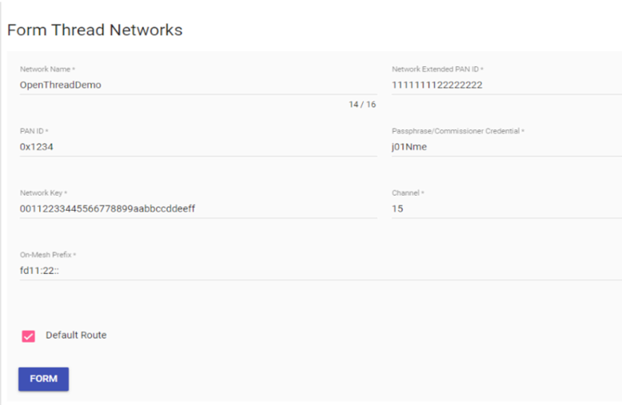

# Form Thread Network in OTBR \(LEADER\)

-   Use the **Form** menu option to create a new Thread network.

1.  Replace all default values on the Form page except for the On- Mesh Prefix to ensure a secure Thread network.
2.  Select **FORM**.
3.  After the network forms, confirm by checking the **Status** menu option.

**Output page :**

 

 

**Parent topic:**[Appendix2: OTBR Network Setup](GUID-392308FE-7D52-4E57-ABDF-47276145DB3E.md)

