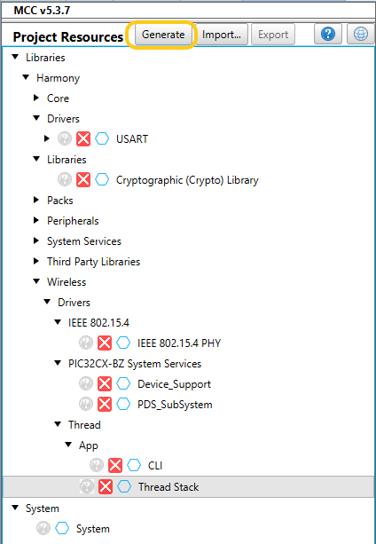
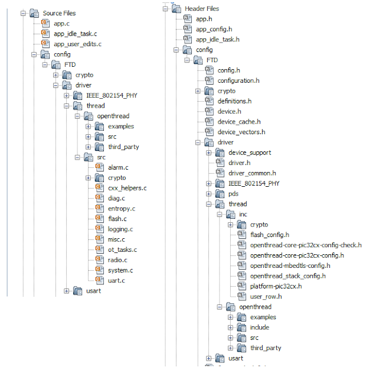

# MCC Project creation for RCP with Thread Component

1.  Create MCC Project for any one of PIC32CXBZ2 devices \(WBZ450 /WBZ451 /PIC32CX1012BZ25048 /PIC32CX1012BZ24032\)
2.  OpenMCC Window. By default, the MCC window will appear as follows.

     

    

     

3.  Once Project graphis getting displayed for the created project, Double click on the **Thread Stack** component.

     

    **Note:**

    -   CLI is not supported with RCP.
    -   Thread Stack component will appear in Device Resources only if wireless\_thread is cloned in MCC framework path
     

     

    

     

4.  Upon selecting the component, the MCC will auto activate the Thread stack dependent modules. Other inter dependent component dependencies will be auto activated and shows Popup for getting the approval. Select “Yes� for all of them.

     

    

     

     

    

     

5.  The Project Graph will look like.

     

    

     

6.  Click on Thread stack component and select RCP available under Device Role option.

     

    

     

7.  The selection of RCP under Device Role will trigger the auto activation of Thread USART capability which in turn auto activate the USART driver. Accept the dependency and auto connection.

     

    

     

8.  RightClick on TIME module for selecting the timer source, Select any of the timer.

     

    

     

9.  Right click onUSART Driver =\> Go to Satisfiers =\> Click on SERCOM0\(sercom0\)

     

    

     

10. Click on SERCOM 0 =\> Go to configuration options =\> Change Receive pinout, Transmitpinout.

     

    

     

11. Configure the SERCOM0 system setting to enable the Direct High Speed inside system Configuration options → Generate Fues → DEVCFG1.

     

    

     

12. Clickon Generate Tab for Code generation. Upon code generation, Thread files will be added to the project.

     

    

     

13. OnceGeneration completed the header, source files of Thread will be added under config =\> driver/thread.

     

    

     

14. RTOS task for thread stack will be created tasks.c file and otSysInit \(\) will be called fromSYS\_Initialize\(\) function.
15. app\_user\_edits.cfile changes: selected line should be commented.

     

    

     

16. Build and Flash the project into WBZ451/WBZ450.

To Bring up Border Router follow the steps provided in [Raspberry Pi setup Procedure](GUID-727F605E-7133-4F54-B908-6DCC6893FBC1.md) and [OTBR Network Setup](GUID-392308FE-7D52-4E57-ABDF-47276145DB3E.md) sections.

**Parent topic:**[Microchip Thread SDK](GUID-35F8786B-0912-4736-BD9F-7975E01A9D0E.md)

