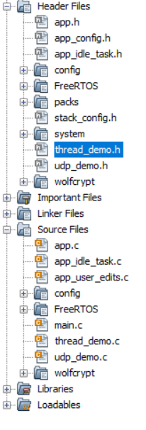
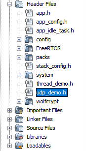
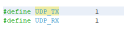
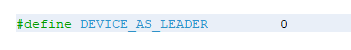
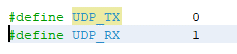
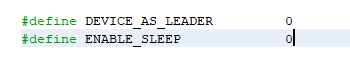
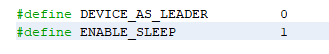

# Application Configuration

**Release details**

In this release, there are 4 hex  files and 2 projects included

The hex files are named as follows:

1.  demo\_app\_udp\_ftd\_leader.hex
2.  demo\_app\_udp\_ftd\_router.hex
3.  demo\_app\_udp\_mtd\_med.hex
4.  demo\_app\_udp\_mtd\_sed.hex

It is recommended to first flash the demo\_app\_udp\_ftd\_leader.hex file and then  flash the remaining hex files to their respective nodes.

Additionally, there  are 2 projects bundled with this release:

1.  demo\_app\_udp\_ftd
2.  demo\_app\_udp\_mtd

Once the hex files have been flashed as per the release details, the nodes will  automatically form a network and begin transmitting data.

**To configure FTD as a leader**

Please open the demo\_app\_udp\_ftd.x file using MPLAB X IDE and navigate to the  thread\_demo.h file as directed.

Please modify the macro DEVICE\_AS\_LEADER to a value of 1, as demonstrated below:

Navigate to udp\_demo.h as shown below.

Please access the file udp\_demo.h as demonstrated below.

The project now includes a Leader functionality that offers the same features as the  demo\_app\_udp\_ftd\_leader.hex.

**To configure FTD as a router**

Please open the demo\_app\_udp\_ftd.x file using MPLAB X IDE and navigate to the  thread\_demo.h file as described previously.

Edit the macro DEVICE\_AS\_LEADER to 0 as shown below.

Please navigate to the file udp\_demo.h and implement the modifications as indicated  below.

  

The project now includes Router functionality that is identical to the functionality  found in the demo\_app\_udp\_ftd\_router.hex file.

**To configure MTD as an MED**

Please open the demo\_app\_udp\_mtd.x file using MPLAB X IDE and navigate to the  thread\_demo.h file as described previously.

Edit the macro DEVICE\_AS\_LEADER to 0 and ENABLE\_SLEEP to 0 as show below. 

Navigate to the file udp\_demo.h and implement the modifications as indicated below.

Now the project has MED functionality having the same functionality as  demo\_app\_udp\_mtd\_med.hex

**To configure MTD as SED**

Please open the demo\_app\_udp\_mtd.x file using MPLAB X IDE and navigate to the  thread\_demo.h file as described previously.

Edit the macro DEVICE\_AS\_LEADER to 0 and ENABLE\_SLEEP to 1 as show below. 

Navigate to the file udp\_demo.h and implement the modifications as indicated below.

The project now includes SED functionality that is equivalent to the functionality found  in demo\_app\_udp\_mtd\_sed.hex.

**Parent topic:**[UDP Application Description](GUID-5C85850D-6ABD-4709-A792-CAFD09C69AD5.md)

