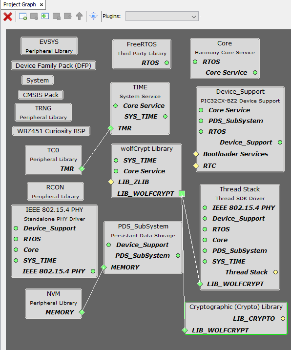
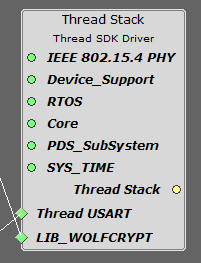

# Thread MCC Component Overview

Thread SDK MCC Component is based on single component with Device Role selection and based on the  device role, the configuration options will be populated. The Thread Stack Component in  MPLAB Code Configurator has certain dependencies and capabilities. Some dependencies are  mandatory, while others are only necessary when certain functional features are  included. The table below provides details on these dependencies and their  requirements.

 

|Dependency Component|Dependency Type|Description|
|--------------------|---------------|-----------|
|IEEE 802.15.4 PHY|Mandatory|Phy lib is mandatory requirement for using the IEEE 802.15.4  based radio services.|
|RTOS|Mandatory|Thread uses RTOS service as per functional design.|
|Core|Mandatory|Thread uses Core service as per functional design.|
|PDS\_SubSystem|Mandatory|Thread uses Persistent Data Server for Data backup.|
|SYS\_TIME|Mandatory|Phy lib Uses SYS\_TIME for internal Timer Purposes.|
|LIB\_WOLFCRYPT|Mandatory|Thread uses crypto services from LIB\_WOLFCRYPT.|
|Thread USART|Optional|Thread USART is not a mandatory service and required when a  serial Parser \(CLI\) or RCP or a Logger\(if CLI is enabled\) is  enabled.|
|Thread Log|Optional|Thread Log is not a mandatory service and required when Thread  Log is enabled when Serial Parser\(CLI\) is not enabled.|

 

Thread has a Capability of its own which can be used by other components whenever Thread  Stack Service is necessary.

 

**Note:** By default **Thread USART** and **Thread Log** dependencies are disabled and will be enabled based on the feature selected.

 

The image below provides the MPLAB Code Configurator view of Thread Stack and its  dependencies.

 

 

The below image depicts the **Thread USART** dependency when Serial Parser\(CLI\) or RCP  is enabled.

 

 

The below image depicts the **Thread Log** dependency when log is enabled, Serial  Parser\(CLI\) and RCP is disabled.

 

 

**Parent topic:**[Microchip Thread SDK](GUID-35F8786B-0912-4736-BD9F-7975E01A9D0E.md)

