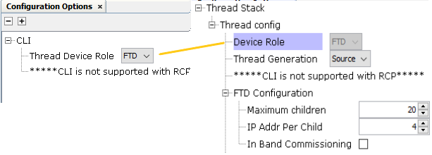
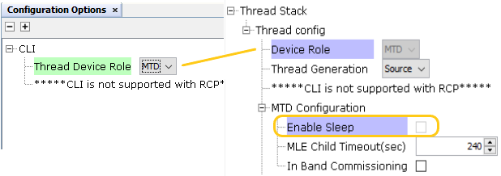

# CLI MCC Configuration

The Thread CLI MCC configuration offers the option to select the Thread Device Role, with  only two choices available in the CLI configuration: FTD and MTD. It is important to  note that RCP is not supported in the CLI. The device role selected in the CLI will  update the device role in the Thread stack configuration, which will then populate the  device role-specific configurations in the Thread Stack Configuration options. By  default, the device role in the CLI is set to FTD.

The image below illustrates the CLI configuration based on the selected device role and  its corresponding options.

**Configuration of CLI and FTD** - The device role selected as FTD in the CLI  configuration corresponds to the device role specified in the thread stack  configuration, as shown in the image below. There are no limitations in FTD  configuration when CLI services are included.

 

 

**Configuration of CLI and MTD** - The device role selected as MTD in the CLI  configuration corresponds to the device role specified in the thread stack  configuration, as shown in the image below. The option to enable Sleep mode cannot be  selected while CLI services are in use.

 

 

For more details about device role specific configuration options refer [Thread SDK MCC Configuration.](GUID-C3A4ADD3-79E7-493B-AF3B-2ECFD7BDD424.md)

**Parent topic:**[MCC Component Configuration](GUID-E585B16B-5D65-41F2-B234-6864EA47D41C.md)

