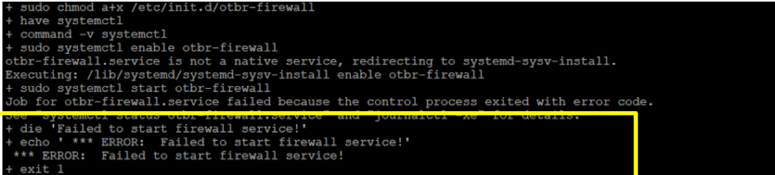

# Compile and install OTBR

**To enable the NAT64 translator :**

-   `# sudo NAT64=1 NAT64_SERVICE=openthread ./script/bootstrap`
    1.  **Use Ethernet :**
        -   `# *sudo INFRA\_IF\_NAME=eth0 ./script/setup*`
    2.  **Use Wifi :**
        -   `# *sudo INFRA\_IF\_NAME=wlan0 ./script/setup*`

**Whenever you face this error with this command :**

 

 

1.  Reboot the system
    -   `*\# sudo reboot*`
2.  Change directory to ot-br-posix
    -   `*\# cd /opt*`
    -   `*\# cd ot-br-posix*`
3.  Then try same command

**Parent topic:**[Appendix1: Raspberry Pi Setup Procedure](GUID-727F605E-7133-4F54-B908-6DCC6893FBC1.md)

