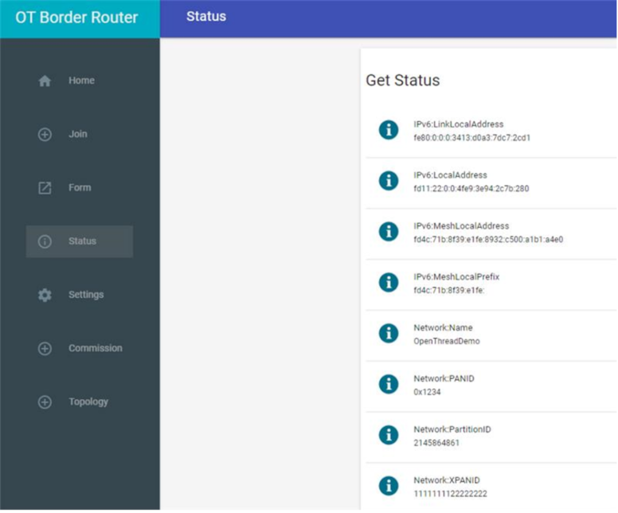

# Sending data using ICMpv6 Protocol

**NOTE :** Get OTBR Link-Local Address from OTBR web GUI page.

**Go to \> OTBR web GUI \> click on status**

Status of OTBR shown in below :

 

 

**Router****:**Send an ICMPv6 Echo Request to Leader \(OTBR\) by using  Link-Local Address of Unicast

**Ping Command :**

|ping -I \[source address\] <ipaddr\> \[destination address\]  <ipaddr\> \[size\] \[count\] \[interval\] \[hoplimit\]|

**Parent topic:**[Appendix2: OTBR Network Setup](GUID-392308FE-7D52-4E57-ABDF-47276145DB3E.md)

