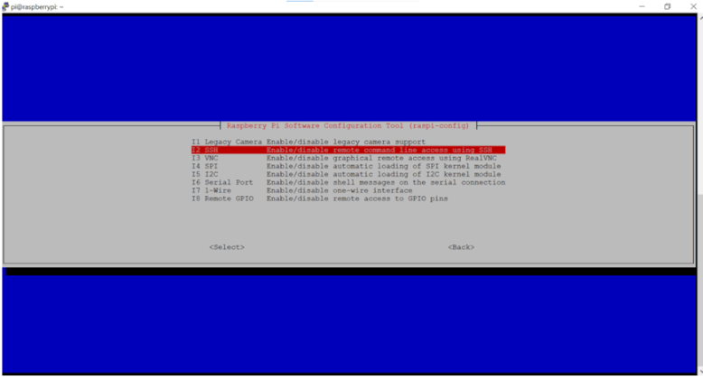
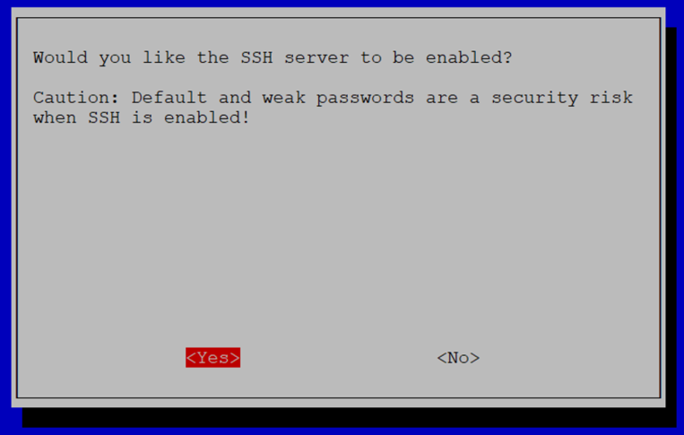
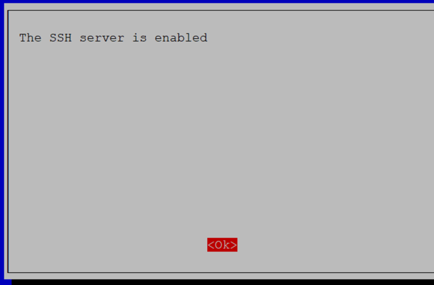

# Enable SSH Interface Configuration

**Enter****_:_**`*sudo raspi-config*`

-   Enable SSH from Interface options Manually
-   Select Interface options -\> Select SSH -\> Click “Yes�

 

 

 

 

 

 

 

 

**Parent topic:**[Appendix1: Raspberry Pi Setup Procedure](GUID-727F605E-7133-4F54-B908-6DCC6893FBC1.md)

