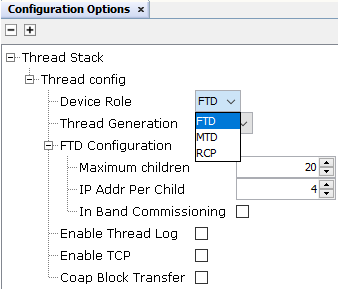
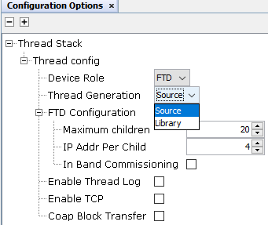
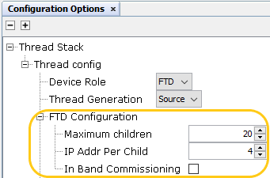
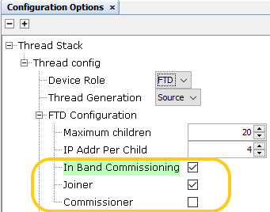
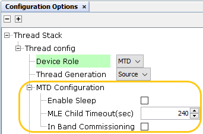
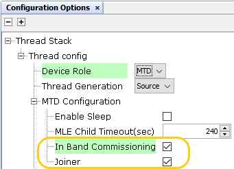
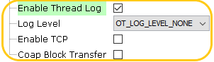
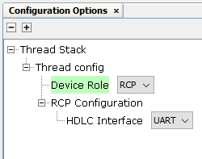

# Thread MCC Configuration

The configuration of Thread MCC is categorized into two parts: common configuration and  Device Role Specific configuration. The configuration for Device Role selection is  included in the Thread MCC Configuration options. If CLI services are being used, the  authority to select Device Role configuration will be in CLI, and the options for device  role specific configuration will be displayed in the thread configuration options. The  Common configuration options are not are not applicable when the device role selected is  RCP. The below image depicts the thread device role configurations.

 

 

Thread Code can be generated as source or library and image below depicts the thread  generation configuration.

 

 

**Full Thread Device\(FTD\) MCC Configuration Options:**

The following image illustrates the role of the device as FTD and the available  configuration options for FTD in the Thread Stack configuration options window.

 

 

From the above image FTD configuration details are as follows

**Maximum children**- The maximum number of children supported by the FTD device. The  default number of children supported is 20.

**IP Addr Per Child**- The maximum number of supported IPv6 address registrations  per child. The default value is 4.

**In Band Commissioning** - It is a boolean selection option which is by default  disabled. In Band Commissioning has two sub options if enabled.

-   **Joiner** - Enables Joiner for In Band Commissioning. Default Value is enabled.
-   **Commissioner** – Enables Commissioner for In Band Commissioning. Default Value is Disabled.

    The image  below depicts the In Band Commissioning in FTD configuration and its sub  configuration options.

    

**Minimal Thread Device\(MTD\) MCC Configuration Options:**

The following image illustrates the role of the device as MTD and the available  configuration options for MTD in the Thread Stack configuration options window.

 

 

From the above image MTD configuration details are as follows

**Enable Sleep** - Enables Sleep Feature. Sleep Feature is by default disabled and  cannot be enabled when CLI is included \(in use\).

**MLE Child Timeout\(sec\)** - The default MLE child timeout value \(in seconds\). The  default value is 240.

**In Band Commissioning** - It is a boolean selection option which is by default  disabled. In Band Commissioning has one sub options if enabled.

-   **Joiner** - Enables Joiner for In Band Commissioning. Default Value is enabled.

    The image below depicts the In Band  Commissioning in MTD configuration and its sub configuration  options.

    

**Common MCC Configuration Options:**

The following image illustrates the common configuration options for FTD and MTD available  in the Thread Stack configuration window.

 

 

From the above image common configuration details are as follows

**Enable Thread Log** - It enables the built in logger service from the open thread  implementation which in turn uses drv\_usart for serial output logging. Log Feature is by  default disabled, if enabled the log level selection is OT\_LOG\_LEVEL\_NONE. Users must  change the log level as per the requirement.

 

**Note:** The default log level in thread prebuilt Library\(.a\) is set to OT\_LOG\_LEVEL\_DEBUG and dynamic log level control is possible.

 

**Enable TCP** - It is a boolean options which enables the TCP service and by default  the option is disabled.

**Coap Block Transfer**- It is a boolean option which enables Coap Block Transfer and  by default the option is disabled.

 

**Note:** Coap Block transfer is supported upto 512 bytes of block data only\(block-512\).

 

**Radio Co-Processor\(RCP\) MCC Configuration Options:**

The following image illustrates the role of the device as RCP and the available  configuration options for RCP in the Thread Stack configuration options window.

 

 

**HDLC Interface** - Interface to communicate with the Host device.

 

**Note:** In this current release RCP supports only UART based host interface protocol.

 

**Parent topic:**[MCC Component Configuration](GUID-E585B16B-5D65-41F2-B234-6864EA47D41C.md)

