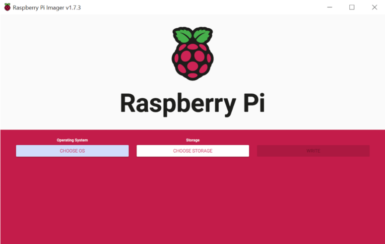

# Installation Procedure for Raspberry Pi

Download the 2022-09-22-raspios-bullseye-arm64-lite.img from

[https://downloads.raspberrypi.org/raspios\_lite\_arm64/images/raspios\_lite\_arm64-2022-09-26/2022-09-22-raspios-bullseye-arm64-lite.img.xz](https://downloads.raspberrypi.org/raspios_lite_arm64/images/raspios_lite_arm64-2022-09-26/2022-09-22-raspios-bullseye-arm64-lite.img.xz)

Download and **Install Raspberry Pi Imager** from

[https://downloads.raspberrypi.org/imager/imager\_latest.exe](https://downloads.raspberrypi.org/imager/imager_latest.exe)

flash the above **2022-09-22-raspios-bullseye-arm64-lite.img** in SD card by using the  Raspberry Pi imager.

**Follow the below screenshots for reference:**

**STEP: 1**

 

 

**STEP: 2** Select Use custom option

 

 

**STEP: 3** Choose image

 

 

**Parent topic:**[Appendix1: Raspberry Pi Setup Procedure](GUID-727F605E-7133-4F54-B908-6DCC6893FBC1.md)

