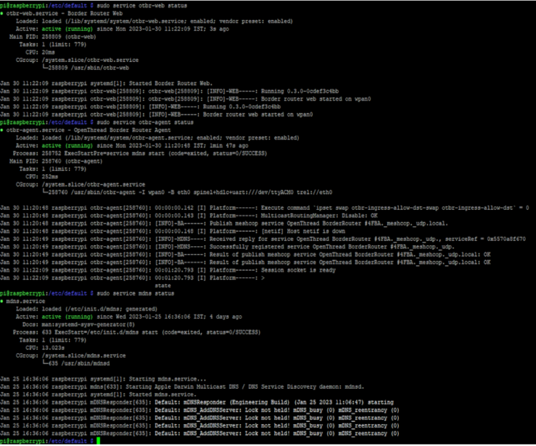

# Verify services

`**\# sudo systemctl status**`

-   If the setup script was successful, the following services appear in the output:
    -   **mdns.service**
    -   **otbr-agent.service**
    -   **otbr-web.service**

**_NOTE :_ Sometime otbr-web will not start by default. use the following commands to enable it.**

**Need to install npm**

**`# sudo apt-get npm`**

`# cd /opt/ot-br-posix`

`# WEB_GUI=1 ./script/bootstrap`

**Ethernet :**`# sudo INFRA_IF_NAME=eth0 WEB_GUI=1 ./script/setup` 

**Wi-Fi :**  `# sudo INFRA_IF_NAME=wlan0 WEB_GUI=1 ./script/setup`

**_NOTE :_***you can also check each service individually*

-   `**\# sudo service mdns status**`
-   `**\# sudo service otbr-agent status**`
-   `**\# sudo service otbr-web status**`

**Output console :**

-   `# sudo service mdns status -`**Active**
-   `# sudo service otbr-agent status -`**Active**
-   `# sudo service otbr-web status`**- Active**

**NOTE :**While checking the service status , if you face any Errors \(Highlighted with  red color\) . re-start the service and start it again.

-   `**\# sudo service mdns restart**`
-   `**\# sudo service otbr-agent restart**`
-   `**\# sudo service otbr-web restart**`

 

 

**Parent topic:**[Appendix1: Raspberry Pi Setup Procedure](GUID-727F605E-7133-4F54-B908-6DCC6893FBC1.md)

