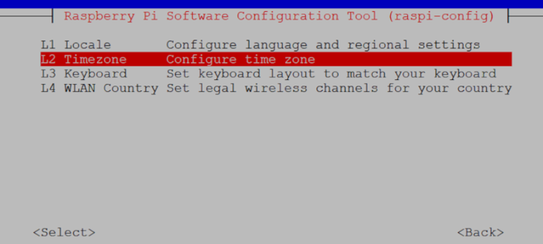
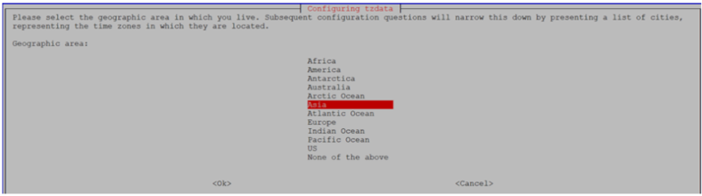

# Set time Zone

-   change time zone as Asia/Kolkata from localization.
-   change time as current time by using this below command
-   \# **_sudo date -s “ date-month-year Hours: Minutes: seconds “_**
-   **_Example :_** `# sudo date -s "16-sep-2023 03:10:14"`

 

 

 

 

 

 

 

 

**Parent topic:**[Appendix1: Raspberry Pi Setup Procedure](GUID-727F605E-7133-4F54-B908-6DCC6893FBC1.md)

